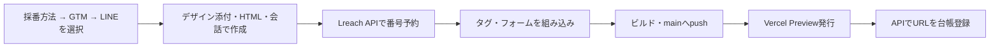

# Lreach LP

マーケターがLPのデザインとコードを管理する独立プロジェクトです。回答データの保存・Slack通知・LINEシナリオ・採番台帳は、既存Lreachの `backend/` が担当します。

## 使い方

1. Node.js 24で `npm ci --legacy-peer-deps` で依存をインストールする。
2. `vercel login` で、LPプロジェクトへの権限があるアカウントにログインする。
3. Codex／Claudeで「create-lpを使って、テンプレートから新しいLPを発行して」と依頼する。接続先・発行用トークン・Vercel linkは自動設定される。

単独で `npm run dev` を使う開発者だけ、`.env.example` を参考に公開backend URLを指定してください。DBやSlackのキーは置きません。

[発行Skill](.agents/skills/create-lp/SKILL.md) は、採番方法 → GTMタグ → LINEシナリオ → デザインの進め方を選択肢UIで案内し、作成したLPをVercel Previewへ発行します。スキル名は `create-lp`（表示名「LP作成」）、内部CLI名は引き続き `lp-saiban` です。新規LPの回答形式は99Y互換です。

## ブランチ運用

このリポジトリは `main` のみで運用します。LPの変更を検証してmainへコミット・pushすると、GitHub Actionsでビルドを確認します。developやLPごとの作業ブランチは作成しません。既存Lreach本体のブランチ運用は別管理です。

mainへのpushと本番公開は別です。発行スクリプトはVercel Previewを作成します。GitHubとVercelの自動連携を追加する際は、mainへのpushが本番デプロイになる設定かを管理者が確認してください。

## 自動発行

Codex／Claudeに「create-lpで、特徴カードのテンプレート・Meta広告用・自動採番でLPを作って」と依頼します。AIが採番方法、広告タグ（GTM）、LINEシナリオを選択肢UIで1問ずつ確認し、その後に「デザイン添付／HTMLファイル／チャットで一緒に作成」を選んでもらいます。指定済みの項目は聞き直さず、内容が決まったら仕様ファイルの作成から実行します。利用者にDB編集は不要です。本番backendと発行用設定は登録済みです。別端末ではVercelログインとLPプロジェクトへのアクセス権を用意します。

- `npm run lp-saiban -- templates`: デザイン候補を表示。
- `npm run lp-saiban -- options`: APIからタグ・既存LP・対応する挙動を取得。
- `npm run lp-saiban -- init .lp-publish/draft-example.json`: 対話内容からデザイン・仕様を生成。
- `npm run lp-saiban -- issue specs/example.json`: 採番からPreview URL登録まで実行。
- `npm run test:publisher`: ローカルAPI・Git・Vercel代替を使って発行と失敗後の再開を検証。実環境に採番・通知しない。

Vercelにログイン済みでLPプロジェクトへの権限があれば、CLIが本番backendへ自動接続します。発行用トークンだけをVercelからメモリ上へ取得し、手入力・端末ファイルへの保存は不要です。テンプレート2種類と添付HTMLに対応し、フォームの挙動は99Y互換です。登録済みのGTM・Meta・TikTok・Google Ads・管理者確認済みのその他タグから選択できます。

同じ `issue` の再実行は発行状態に応じて再開します。結果不明のデプロイは自動でやり直しません。登録済みLPのデザイン更新は新規採番フローとは別に扱います。発行コマンドはmainを自動pushするため、VercelのGit自動連携があるプロジェクトでは停止します（main pushによる意図しない本番公開を防ぐため）。

## 既存LP

99A・99Y・08Aを含む既存画面・画像はそのまま移しています。`npm run verify` は初回移行時に元の2388ファイルと一致するかを検査します。その後の意図したデザイン編集では差分が出るため、日常のビルドとは分けています。

`lib/supabase` は既存画面との互換アダプターです。Supabaseの操作はLreach backendのAPIを通り、ブラウザはDBキーを持ちません。`/api/*` はbackendへのrewriteです。

## 管理者の初期設定

- GitHubの書き込み権限とVercelのログインを用意する。LP用Vercelプロジェクトへの端末のlinkはCLIが自動作成する。
- 管理者が `lreach-lp-marketing` のDevelopmentに限定した `LP_PUBLISH_TOKEN` を登録する。DBキーや通知用秘密情報はbackendだけで管理する。
- DBのmigrationと既存番号・広告タグの棚卸しをLreach側で完了する。
- Vercel Preview保護が有効な場合、LPからbackendへのリクエストも保護対象になる。既存チームの開発用接続方式を設定してから回答テストを行う。
- 新規Vercelプロジェクトの初回デプロイはPreview指定でもProduction扱いになる場合がある。管理者が初期化し、以降の発行で実際のtargetを検査する。
- 既存Lreach本体のdevelop/mainへのマージと既存ドメイン・HTTPSの切替は、この発行スクリプトでは実行しない。

`.lp-publish/` は依頼IDとデプロイ再開情報を保持します。同じ依頼の再送時に削除しないでください。番号予約後に止まっても、別番号でやり直さず状態ファイルから続行します。

### 保護されたPreviewの回答API接続

新規発行LPの回答は `/api/lp/v1/submissions/` のサーバー側プロキシを通します。本番backendへ接続する通常の発行では保護解除用の入力は不要です。本番backendは公開済みLPの登録URLからだけ回答を受け付けるため、Previewの回答は本番DBに保存されません。開発DBで保存を検証する別環境を使う場合は、管理者がVercel Preview環境の `LREACH_BACKEND_PROTECTION_BYPASS` にバックエンドのAutomation Bypassを設定してください。ブラウザ用変数には設定しません。採番CLIでは同じ秘密情報を `LP_PUBLISH_PROTECTION_BYPASS` に設定します。どちらもリポジトリへ保存しません。旧LPの互換APIと本番ドメインの移管は別途検証します。

Previewで回答保存を検証するときは、管理者が `LP_PREVIEW_BACKEND_PROXY_ENABLED=true` と `LP_PREVIEW_BACKEND_ORIGIN=<backend Previewのorigin>` を設定します。`LREACH_DEPLOY_ENV=staging`、`OUTBOUND_DELIVERY_ENABLED=false`、`OUTBOUND_DISABLED=true` を維持します。この例外は指定したバックエンドの `/api/lp/v1/submissions/` へのPOSTだけで、Slack・LINE・他APIへの送信を許可しません。

通常は `npm run lp-saiban -- options` だけで、本番backend（https://lreach-backend.vercel.app）から候補を取得できます。初回だけ `vercel login` とLPプロジェクトのアクセス権が必要です。従来の `.lp-publish/runtime.env` は別環境を明示するときだけ利用できます。手動指定する場合は `LP_PUBLISH_API_URL` と `LP_PUBLISH_TOKEN` を両方指定してください。片方だけでは自動取得したトークンを別接続先へ渡しません。

### 2026-09-28 本番backendの稼働確認

- `lreach-backend.vercel.app` をProductionに公開。Lreach mainの `c248a386202727d962f1248970ba1345d0f78189` を使用。
- 本番DBの237番号、確認済み共通GTM、3種類のLINEシナリオを認証済みoptions APIで取得済み。未認証の管理APIは401。
- LP専用プロジェクトのDevelopmentには限定発行トークンだけを配布。CLIはこれを毎回メモリ上に取得し、端末に秘密ファイルを作らない。
- 既存LPのドメイン切替・新規LPのProduction公開は別操作。新backendの旧LP互換APIと新規LPのSlack通知はまだ有効化していない。LINE・Slackの実送信は未検証。
