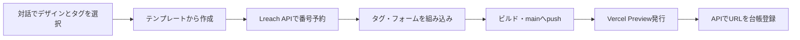

# Lreach LP

マーケターがLPのデザインとコードを管理する独立プロジェクトです。回答データの保存・Slack通知・LINEシナリオ・採番台帳は、既存Lreachの `backend/` が担当します。

## 使い方

1. Node.js 24で `npm ci --legacy-peer-deps` で依存をインストールする。
2. `.env.example` を参考にLreach backendのURLを設定する。DBやSlackのキーは置かない。
3. `npm run dev` で表示を確認する。
4. Codex／Claudeで「lp-saibanを使って、テンプレートから新しいLPを発行して」と依頼する。

[発行Skill](.agents/skills/lp-saiban/SKILL.md) は、番号の自動／手動指定、登録済み広告タグの選択、デザイン作成、Vercel Preview発行を案内します。新規LPの回答形式は99Y互換です。

## ブランチ運用

このリポジトリは `main` のみで運用します。LPの変更を検証してmainへコミット・pushすると、GitHub Actionsでビルドを確認します。developやLPごとの作業ブランチは作成しません。既存Lreach本体のブランチ運用は別管理です。

mainへのpushと本番公開は別です。発行スクリプトはVercel Previewを作成します。GitHubとVercelの自動連携を追加する際は、mainへのpushが本番デプロイになる設定かを管理者が確認してください。

## 自動発行

Codex／Claudeに「lp-saibanで、特徴カードのテンプレート・Meta広告用・自動採番でLPを作って」と依頼します。AIが名称・媒体・デザイン・タグを確認し、仕様ファイルの作成から実行します。利用者にDB編集は不要です。初回のAPI・権限設定は管理者が行います。

- `npm run lp-saiban -- templates`: デザイン候補を表示。
- `npm run lp-saiban -- options`: APIからタグ・既存LP・対応する挙動を取得。
- `npm run lp-saiban -- init .lp-publish/draft-example.json`: 対話内容からデザイン・仕様を生成。
- `npm run lp-saiban -- issue specs/example.json`: 採番からPreview URL登録まで実行。
- `npm run test:publisher`: ローカルAPI・Git・Vercel代替を使って発行と失敗後の再開を検証。実環境に採番・通知しない。

`LP_PUBLISH_API_URL` と `LP_PUBLISH_TOKEN` はコマンドの実行環境だけに設定します。ブラウザ用の環境変数にはしません。テンプレート2種類と添付HTMLに対応し、フォームの挙動は99Y互換です。登録済みのGTM・Meta・TikTok・Google Ads・管理者確認済みのその他タグから選択できます。

同じ `issue` の再実行は発行状態に応じて再開します。結果不明のデプロイは自動でやり直しません。登録済みLPのデザイン更新は新規採番フローとは別に扱います。発行コマンドはmainを自動pushするため、VercelのGit自動連携があるプロジェクトでは停止します（main pushによる意図しない本番公開を防ぐため）。

## 既存LP

99A・99Y・08Aを含む既存画面・画像はそのまま移しています。`npm run verify` は初回移行時に元の2388ファイルと一致するかを検査します。その後の意図したデザイン編集では差分が出るため、日常のビルドとは分けています。

`lib/supabase` は既存画面との互換アダプターです。Supabaseの操作はLreach backendのAPIを通り、ブラウザはDBキーを持ちません。`/api/*` はbackendへのrewriteです。

## 管理者の初期設定

- GitHub/Vercel接続、Preview環境変数、発行用API・トークンを設定する。
- DBのmigrationと既存番号・広告タグの棚卸しをLreach側で完了する。
- Vercel Preview保護が有効な場合、LPからbackendへのリクエストも保護対象になる。既存チームの開発用接続方式を設定してから回答テストを行う。
- 新規Vercelプロジェクトの初回デプロイはPreview指定でもProduction扱いになる場合がある。管理者が初期化し、以降の発行で実際のtargetを検査する。
- 既存Lreach本体のdevelop/mainへのマージと既存ドメイン・HTTPSの切替は、この発行スクリプトでは実行しない。

`.lp-publish/` は依頼IDとデプロイ再開情報を保持します。同じ依頼の再送時に削除しないでください。番号予約後に止まっても、別番号でやり直さず状態ファイルから続行します。

### 保護されたPreviewの回答API接続

新規発行LPの回答は `/api/lp/v1/submissions/` のサーバー側プロキシを通します。管理者がVercel Preview環境の `LREACH_BACKEND_PROTECTION_BYPASS` にバックエンドのAutomation Bypassを設定してください。ブラウザ用変数には設定しません。採番CLIでは同じ秘密情報を `LP_PUBLISH_PROTECTION_BYPASS` に設定します。どちらもリポジトリへ保存しません。旧LPの互換APIと本番ドメインの移管は別途検証します。

Previewで回答保存を検証するときは、管理者が `LP_PREVIEW_BACKEND_PROXY_ENABLED=true` と `LP_PREVIEW_BACKEND_ORIGIN=<backend Previewのorigin>` を設定します。`LREACH_DEPLOY_ENV=staging`、`OUTBOUND_DELIVERY_ENABLED=false`、`OUTBOUND_DISABLED=true` を維持します。この例外は指定したバックエンドの `/api/lp/v1/submissions/` へのPOSTだけで、Slack・LINE・他APIへの送信を許可しません。

管理者が端末の `.lp-publish/runtime.env`（権限600）へ限定した発行用トークンと接続先を設定すると、`npm run lp-saiban` が自動で読み込みます。このディレクトリはGitとVercelのアップロードから除外されます。Supabase・Slack・LINEの秘密情報は置きません。
