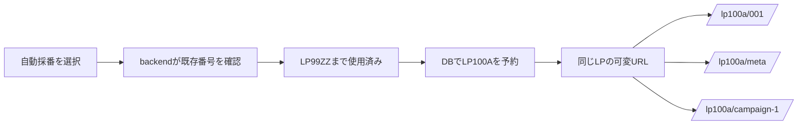
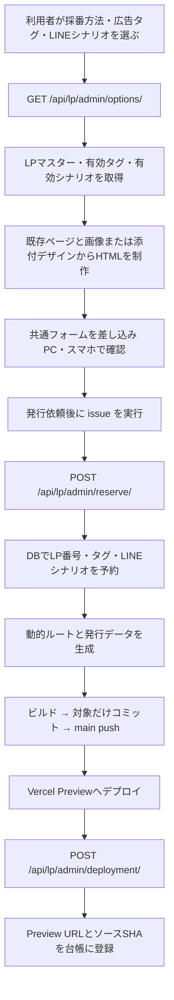
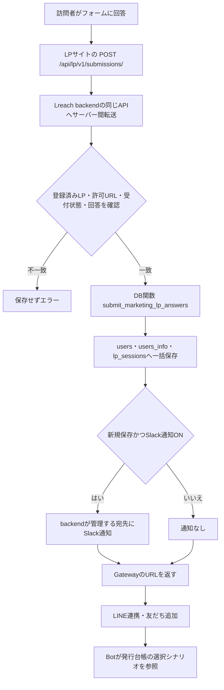

# LP発行・回答保存の仕組み

確認日: 2026-09-28。発行コードとbackendの実装、発行APIの読み取り結果、Vercelの現在の設定を確認。新LPの実採番・デプロイ・実回答送信・Slack送信は今回実行していない。

## LP番号とURL末尾

- LP番号はLPを識別する番号。自動採番では `code:null` をbackendへ送り、DBが確定する。
- 現在の発行APIのマスターは237件で、最大数値部分は99、末尾にLP99ZZがある。
- 修正後のDBルールは `A〜Z → AA〜ZZ → 次の数値のA`。LP99ZZ → LP100A → LP100B と続く。LP100Z → LP100AA、LP100ZZ → LP101A。既存の穴埋めはしない。CLIはAPIの `numbering.policy=suffix-v1` を確認してから予約する。
- DBは `lp_master` に加え `lp_production_management`、`link_meta`、`lp_sessions` の番号も参照する。同時発行をトランザクションのロックで直列化し、一意制約で重複を防ぐ。同じ依頼IDでの再実行は同じ番号になる。
- URLは `/deaeru/<LP番号>/[id]/`。末尾はアクセスごとの可変値。`001`、`meta`、`campaign-1` などを同じLPで受け付ける。発行仕様に `inflow` や `direct` は保存しない。
- 画面確認URLの `/001/` は一例。発行後も他のIDを使える。現在のbackend契約では英小文字・数字と、区切りとしてのハイフンを受け付ける。

採番の正本はbackend側の `lp_master`。初期番号はリポジトリの既存ルート等を棚卸しして取り込む仕組み。別システム・別DBのLPマスターを毎回自動同期する実装ではないため、別経路で新番号を作る場合もこの正本への登録が必要。

## 制作からデプロイまで

`options` APIは既存LPのHTMLや画像を返さない。LP99Aを参考にする今回の作業では、リポジトリの `app/deaeru/lp99a/[id]/` と `public/` の画像を読んでデザインを作った。

`init` はローカルの `specs/<slug>.json` と `designs/<slug>.html` を作るだけで、採番しない。HTMLの `{{LREACH_FORM}}` 1か所を `renderPublishedPage` が共通フォームと送信用JavaScriptに置き換える。

`issue` は同じ `.lp-publish/<slug>.json` の依頼ID・途中状態を使い続ける。登録だけ失敗した場合は既存URLの登録から再開し、番号やデプロイを増やさない。Git自動デプロイが接続されたプロジェクトでは停止し、main pushだけで意図せずProductionになることを防ぐ。この操作の到達点はPreviewであり、Production昇格・ドメイン切替は別の操作。

発行CLIは既存のVercelログイン権限を使ってLPプロジェクトのDevelopment設定から発行専用トークンだけをメモリ上に読み込む。管理APIの既定接続先は `https://lreach-backend.vercel.app`。ブラウザには発行トークン・DBキー・Slackトークンを渡さない。

## 回答保存・Slack通知・LINE案内

保存内容は氏名・性別・生まれ年・希望勤務地・電話番号の5項目。`lp_sessions.answers` に回答、`lp_key` に `deaeru-<LP番号>-<実際のURL末尾>`、`referrer_url` にクエリも含む流入URLを保存する。氏名・電話番号・生まれ年は `users_info` にも保存する。3テーブルへの書き込みは同じトランザクションで扱う。

ブラウザで発行する回答用UUIDを送信IDとして使い、同じ送信ID・同じ内容の再送ではDB保存とSlack通知を重複させない。同じIDで異なる回答を送ると拒否する。これは同じ人物が別セッションで回答した場合まで重複排除するものではない。

SlackはDB保存後に送る。通知に失敗しても回答保存は成功として返し、`notificationStatus` で失敗を区別する。現行実装には通知失敗の自動再送キューはなく、回答再送時も通知を重複送信しない。宛先とトークンはbackendの環境設定が管理する。

## 旧LPとの相違と現在の設定

| 項目 | 現在確認できた内容 |
| --- | --- |
| LP99Aの見た目 | 既存画像を参照して再利用。HTML/画像はマスターAPIから自動取得するものではない |
| 回答項目 | 新共通フォームは5項目。旧LP99Aには希望年収・希望職種・働き方・転職希望時期もあるため完全一致ではない |
| 保存 | 新API → backend RPC → users / users_info / lp_sessions。コードとローカルテストで確認。今回の新LPで実データ保存は未実施 |
| Slack | 新API用の送信実装はあるが、Vercelの現在の本番設定は `MARKETING_LP_SLACK_ENABLED=false`。旧LPの通知経路・本文・宛先をそのまま継承しない |
| Previewからの保存 | 現在の既定接続先backendは `LREACH_DEPLOY_ENV=production`。このAPIは `published` 状態かつ登録済みProduction URLからの送信だけ許可するため、Previewを発行しただけでは保存できない |
| LINE | 保存成功後に `https://gateway.lreach.jp/deaeru` へ案内する設定。Botが台帳のシナリオを参照するコードあり。今回の新LPで実LINEは未確認 |
| 広告計測 | 選択したタグを使う。`LP_AD_TRACKING_ENABLED=true` かつVercel Productionのときだけ出力。Previewでは無効 |
| 実績表記 | LP99A画像に埋め込まれた人数等を再利用。数値の現時点の裏付けは未確認 |

したがって「このスキルで発行すれば旧LPと同じ全質問・Slack・LINEまで自動で稼働する」という説明は不正確。新LPの本番受付を開始するときは、許可URL・公開状態・通知設定と実際の保存／通知／LINE結果をそれぞれ確認する。

## 今回の検証

- 発行CLI等の20テストが成功。流入ID未指定での作成、生成ルートの `001` / `meta` / `campaign-1` での回答キー切替、再開・二重発行防止を含む。
- backendの採番SQLを一時的なローカルPostgreSQLへ適用。LP99ZZ → LP100A、同じ依頼の再実行、5件の同時発行、既存制作台帳の106Aを避けた107Aの採番を確認。本番DBは変更していない。
- Vercel Previewプロジェクトのチェックが成功。新LPの発行・Production公開・外部通知は未実施。
